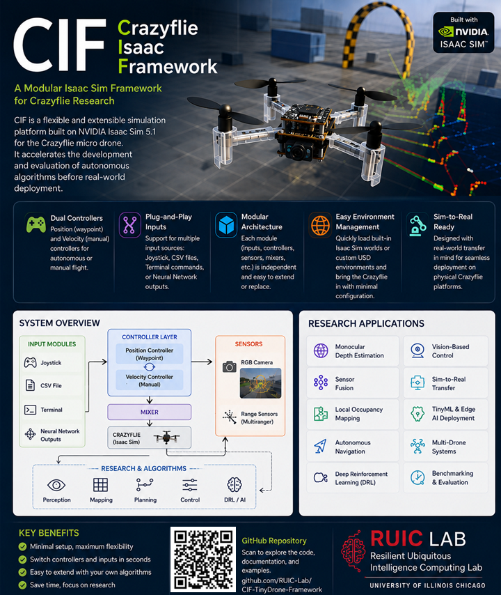

# CIF — Crazyflie Isaac Framework

### A Modular NVIDIA Isaac Sim Framework for Crazyflie Research

CIF is a modular simulation framework built on **NVIDIA Isaac Sim** for developing, testing, and evaluating autonomous algorithms for the **Crazyflie micro aerial vehicle**.

  

---

## About CIF

CIF provides a flexible research environment for Crazyflie autonomy, allowing researchers to rapidly integrate and evaluate new **perception, planning, control, and learning algorithms** before real-world deployment.

The framework is designed around a modular architecture, allowing individual components—including inputs, controllers, sensors, environments, and autonomous algorithms—to be independently configured, replaced, or extended.

The goal of CIF is to provide a unified simulation platform for experimenting with autonomous micro aerial vehicles while supporting the transition from **simulation to real Crazyflie hardware**.

---

## Key Capabilities

- 🎮 **Dual Controllers** — Position (waypoint) and velocity/manual control
- 🔌 **Plug-and-Play Inputs** — Joystick, CSV, terminal commands, and neural-network outputs
- 📷 **Sensor Integration** — RGB camera and Multi-Ranger sensing
- 🧩 **Modular Architecture** — Easily replace or extend controllers, sensors, environments, and algorithms
- 🌎 **Environment Management** — Load Isaac Sim environments or integrate custom USD worlds
- 🚁 **Multi-Drone Simulation** — Support for simultaneous Crazyflie agents and multi-agent experiments
- 🤖 **Learning-Based Control** — Designed to support deep reinforcement learning and neural-network policies
- 🔄 **Sim-to-Real Research** — Designed with physical Crazyflie deployment in mind

---

## 🎥 Demonstrations

### Multi-Drone Navigation with Randomized Start and Goal Positions

This demonstration shows **four Crazyflie drones operating simultaneously in NVIDIA Isaac Sim** using CIF.

Each drone is initialized with a **randomized starting position** and assigned a **randomized target position** within the environment.

The visualization includes:

- 🚁 Four simultaneously simulated Crazyflie drones
- 🎯 Randomized target positions represented by spheres
- 📡 Multi-Ranger sensor measurements visualized around each drone
- ➖ Drone-to-target lines visualizing individual navigation objectives
- 🤖 Independent navigation toward assigned targets

  

  <b>▶ Click the image to watch the simulation demo</b>

---

## Research Applications

CIF is intended to support research in:

- Autonomous Navigation
- Multi-Drone and Multi-Agent Systems
- Deep Reinforcement Learning
- Monocular Depth Estimation
- Vision-Based Control
- Sensor Fusion
- Local Occupancy Mapping
- Path Planning
- TinyML / Edge AI
- Sim-to-Real Transfer
- Robotics Benchmarking

---

## Framework Philosophy

CIF is designed around three principles:

**Modularity** — Components can be independently modified or replaced without redesigning the entire simulation framework.

**Experimentation** — Researchers can rapidly configure sensors, controllers, environments, learning algorithms, and multi-drone scenarios.

**Deployment** — Simulation experiments are designed with eventual deployment to physical Crazyflie platforms in mind.

---

## Project Status

> 🚧 **CIF is currently under active development.**

This repository currently serves as the **public project page for CIF**.

The complete framework, documentation, installation instructions, configuration examples, and source code will be released as development progresses.

---

## Technology

CIF is being developed around:

- **NVIDIA Isaac Sim**
- **Crazyflie Micro Aerial Vehicle**
- **Python**
- **RGB Camera**
- **Multi-Ranger Sensors**
- **Deep Reinforcement Learning**
- **Autonomous Navigation**
- **Multi-Agent Robotics**

---

## Repository

The complete CIF source code is **not yet publicly released**.

This repository currently provides project information and demonstrations while the framework remains under active research and development.

Future releases are planned to include:

- Installation and setup instructions
- Simulation environments
- Crazyflie controllers
- Sensor modules
- Autonomous navigation examples
- DRL environments and policies
- Multi-drone configurations
- Sim-to-real examples
- Developer documentation

---

## Developed at

**Resilient Ubiquitous Intelligence Computing (RUIC) Lab**  
**University of Illinois Chicago**

---

## Contact

**Ömer Kurkutlu**  
PhD Candidate, Electrical and Computer Engineering  
University of Illinois Chicago

GitHub: [@omerKurkutlu](https://github.com/omerKurkutlu)

---

  <b>CIF — Crazyflie Isaac Framework</b> 
  <i>Develop. Simulate. Deploy.</i>

